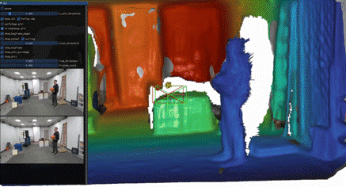

# Dynamic Masking in MASt3R-SLAM

> Extending MASt3R-SLAM with attention-based dynamic object masking for improved camera pose estimation and 3D reconstruction in dynamic environments.

---

## Overview

Classical SLAM systems assume a **static world** — a fundamental limitation when deployed in real environments full of moving people, robots, and objects. This project integrates a two-stage dynamic masking pipeline into [MASt3R-SLAM](https://github.com/nianticlabs/mast3r-slam) to actively detect and suppress dynamic regions, resulting in measurably cleaner reconstructions and more accurate camera tracking.

<!-- Replace with your demo GIF -->


*Left: Our implementation (dynamic objects masked out). Right: Vanilla MASt3R-SLAM baseline.*

---

## Key Results

Our approach achieves consistent improvements in camera pose estimation over the MASt3R-SLAM baseline, evaluated on the **Wild SLAM Mocap Dataset** (10 dynamic RGB-D sequences):

| Metric | MASt3R-SLAM | Ours | Improvement |
|--------|-------------|------|-------------|
| Median ATE | 0.089 | 0.084 | **↓ 6.1%** |
| Mean ATE | 0.095 | 0.085 | **↓ 10.2%** |
| RMSE | 0.103 | 0.095 | **↓ 8.3%** |

Beyond pose accuracy, dynamic objects are visibly cleaner in the reconstructed 3D pointmaps — people and moving props leave far fewer reconstruction artifacts compared to the unmodified baseline.

<!-- Replace with your 3D reconstruction comparison GIF -->


---

## How It Works

The core idea is to intercept the MASt3R-SLAM pipeline after each MASt3R inference step and apply a refined dynamic mask before feature matching and pose estimation.

```
Input Frame
    │
    ▼
[1] MASt3R (cross-attention between current frame & keyframe)
    │
    ├─► Easi3R Attention Disentanglement → Rough Dynamic Mask
    │         │
    │         ▼
    │   Object Detection → Query Points → SAM2 Segmentation
    │                                          │
    │                                          ▼
    │                                   Refined Mask
    │                                          │
    ▼                                          │
[2] Matching (dynamic pixels suppressed) ◄─────┘
    │
    ▼
[3] Global Optimization (pose tracking + pointmap fusion)
```

### Stage 1 — Easi3R Dynamic Mask

[Easi3R](https://easi3r.github.io/) is a **training-free** method that disentangles the attention maps already computed inside DUSt3R/MASt3R. By combining source and reference attention in a specific formulation, it produces a rough heatmap that highlights dynamic regions without any additional model training.

<!-- Replace with your masking GIF -->


*Raw attention heatmap → Easi3R binary mask → Overlay on frame.*

### Stage 2 — SAM2 Refinement

The coarse Easi3R mask is used to extract **query points** at the most dynamic locations. These are passed as prompts to [SAM2](https://github.com/facebookresearch/segment-anything-2), which produces a precise, semantically clean segmentation mask. This two-stage approach combines the zero-shot dynamic detection of Easi3R with the pixel-accurate segmentation quality of SAM2.

<!-- Replace with your SAM2 refinement GIF -->


*Rough Easi3R mask (left) refined to a clean SAM2 segmentation (right).*

---

## Tech Stack

| Component | Role |
|-----------|------|
| [MASt3R-SLAM](https://github.com/nianticlabs/mast3r-slam) | Base SLAM system |
| [MASt3R](https://github.com/naver/mast3r) / [DUSt3R](https://github.com/naver/dust3r) | Transformer-based stereo 3D vision backbone |
| [Easi3R](https://easi3r.github.io/) | Training-free dynamic attention disentanglement |
| [SAM2](https://github.com/facebookresearch/segment-anything-2) | Prompted instance segmentation for mask refinement |
| Python / PyTorch | Implementation |

---

## Dataset

Evaluated on the **Wild SLAM Mocap Dataset** — 10 RGB-D sequences with motion-captured ground-truth trajectories, specifically designed for benchmarking SLAM under dynamic conditions. Scenes include: `ball`, `crowd`, `person_tracking`, `racket`, `stones`, `table_tracking1/2`, `umbrella`, `ANYmal1/2`.

---

## Limitations & Future Work

- **Over-masking**: In scenes with minimal movement, Easi3R can produce noisy masks that suppress valid static features, degrading pose estimation.
- **Runtime**: The additional masking pipeline is ~4x slower than vanilla MASt3R-SLAM.
- **Future directions**: SAM2 video mode with temporal tracking for more consistent masks across frames; better dynamic initialization beyond Easi3R; runtime optimization.

---

## Authors

This project was developed as part of the **Advanced Topics in 3D Computer Vision (AT3DCV)** course at the Technical University of Munich.

| Name | GitHub |
|------|--------|
| Ben Barkow | — |
| Lukas Bruns | — |
| Han My Do | — |

---

## References

- R. Murai, E. Dexheimer, and A. J. Davison, *"MASt3R-SLAM: Real-time Dense SLAM with 3D Reconstruction Priors,"* CVPR 2025.
- V. Leroy, Y. Cabon, and J. Revaud, *"Grounding Image Matching in 3D with MASt3R,"* ECCV 2025.
- S. Wang et al., *"Dust3r: Geometric 3D Vision Made Easy,"* CVPR 2024.
- X. Chen et al., *"Easi3R: Estimating Disentangled Motion from DUSt3R Without Training,"* ICCV 2025.
